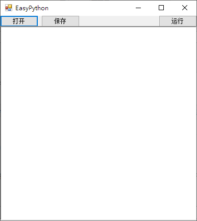

# EasyPython IDE

就是闲得没事干做的，功能几乎没有（但是也是小到极致，目前版本编译后只有70kb）

已加入和计划加入的功能：

- [x] tab键缩进（可调整空格数）
- [x] enter键智能空格
- [x] 一键运行
- [x] 临时文件模式
- [x] 自定义字体
- [x] 多个Python解释器位置
- [x] 配置文件保存
- [ ] 关键字特殊颜色
- [ ] 错误自动跳转

计划是提供与Python解释器同捆的包，方便新手。

如果你希望自行打包，请确认路径结构如下：
.
+-- python
|  +-- python.exe
|  +-- （其他Python相关文件）
+-- EasyPython.exe